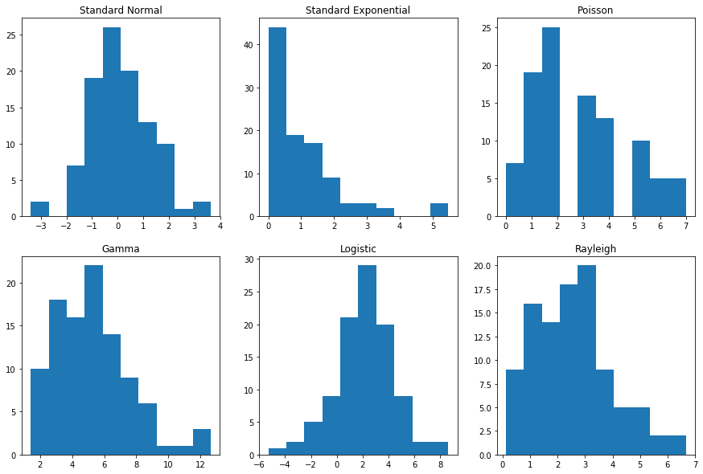
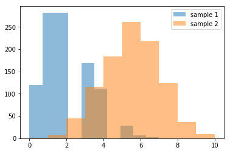
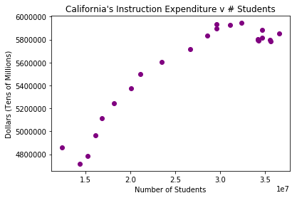
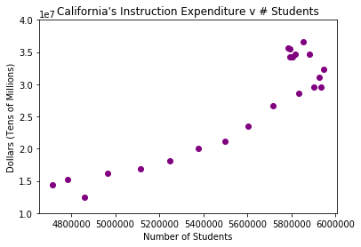
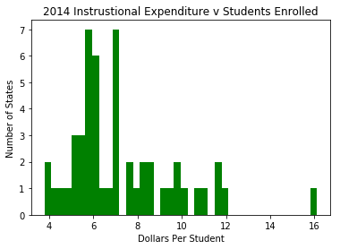

```python
## Import Packages and CSV

import pandas as pd
import numpy as np
import matplotlib.pyplot as plt
%matplotlib inline

df = pd.read_csv('states_all.csv')
```


```python
## A Table containing values for California Only (For Viewing Purposes)
#df.loc[lambda df: df['STATE'] == 'CALIFORNIA', :]
```

In an effort to better understand how California Schools allocate their resources, we will be taking a deeper look into their revenue sources and instructional expenses.


```python
## A Table containing values for California Only (Stored as a Variable)
CA_isolated=df.loc[lambda df: df['STATE'] == 'CALIFORNIA', :]
```


```python
## Plotting California's Total Revenue Over Time

plt.plot(CA_isolated['YEAR'],CA_isolated['TOTAL_REVENUE'])
plt.xlim([1992, 2017])
plt.ylim([20000000, 90000000])
plt.title('California\'s Total Revenue')
plt.xlabel('Year')
plt.ylabel('Dollars (Tens of Millions)')
plt.show()
```





This graph shows how the total revenue of California's schools has changed over time. There is a strong upward trajectory of the revenue over time. There is a noticacble dip in the amount of revenue between 2006 and 2010. This may be related to the economic recession the United States faced at the time. 


```python

```


```python
## Plotting California's Local State and Federal Revenue

plt.figure(figsize=(15, 5))

plt.subplot(1, 3, 1)
plt.plot(CA_isolated['YEAR'],CA_isolated['FEDERAL_REVENUE'], color= 'purple', label = 'line 1')
plt.title('Federal Revenue')
plt.xlabel('Year')
plt.ylabel('Dollars (Tens of Millions)')
plt.ylim([2000000,11000000])


plt.subplot(1, 3, 2)
plt.plot(CA_isolated['YEAR'],CA_isolated['STATE_REVENUE'], color= 'green', label = 'line 2')
plt.title('State Revenue')
plt.xlabel('Year')
plt.ylabel('Dollars (Tens of Millions)')
plt.ylim([10000000,55000000])

plt.subplot(1, 3, 3)
plt.plot(CA_isolated['YEAR'],CA_isolated['LOCAL_REVENUE'], color= 'blue', label = 'line 3')
plt.title('Local Revenue')
plt.xlabel('Year')
plt.ylabel('Dollars (Tens of Millions)')
plt.ylim([1000000,35000000])

plt.tight_layout()
plt.show()
```





These plots show the amount of revenue that the schools generated at the federal, state, and local levels. The local and state streams of revenue showed a noticeable dip around 2007. The Federal revenue actually increased signifigantly at the time. However, since state revenue makes the bulk of the the state's total revenue, California's still schools faced a net loss around 2007. 


```python
## Plotting California's Total Instructional Expenditure VS Number Of Students Enrolled

plt.scatter(CA_isolated['INSTRUCTION_EXPENDITURE'],CA_isolated['GRADES_ALL_G'], color= 'purple', label = 'line 1')
plt.title('California\'s Instruction Expenditure v # Students')
plt.xlabel('Number of Students')
plt.ylabel('Dollars (Tens of Millions)')


plt.show()
```





```python
## Plotting California's Total Instructional Expenditure VS Number Of Students Enrolled

plt.scatter(CA_isolated['GRADES_ALL_G'],CA_isolated['INSTRUCTION_EXPENDITURE'], color= 'purple', label = 'line 1')
plt.title('California\'s Instruction Expenditure v # Students')
plt.xlabel('Number of Students')
plt.ylabel('Dollars (Tens of Millions)')
plt.ylim([10000000,40000000])

plt.show()
```





This graph shows the instructional expenditure vs amount of students for California schools at each year. There's a positive correlation between the number of students enrolled and the amount spent on teaching. The clustering at the top right of the graph reflects increases in instructional expenditure despite the stagnation in the number of students enrolling.


```python

```


```python
## A Table containing values for 2016 Only (For Viewing Purposes)
##df.loc[lambda df: df['YEAR'] == 2016, :]
```


```python
## Determining California's Instructional Expenditure v. Number of Students Enrolled

CA_isolated_2014=CA_isolated.loc[lambda df: df['YEAR'] == 2014, :]
CA_isolated_2014['INSTRUCTION_EXPENDITURE']/CA_isolated_2014['GRADES_ALL_G']
```


    1131    6.133683
    dtype: float64


```python
## Making variable for Instructional Expenditure Vs Students

Most_Recent = df.loc[lambda df: df['YEAR'] == 2014, :]
```


```python
IExpenditure_vs_student = Most_Recent['INSTRUCTION_EXPENDITURE']/Most_Recent['GRADES_ALL_G']
```


```python

```


```python

```


```python
## A Histogram of Instructional Expenditure vs Number of Stunents Enrolled for all 50 States

plt.hist(IExpenditure_vs_student, bins=40, color='green')
plt.title('2014 Instrustional Expenditure v Students Enrolled')
plt.xlabel('Dollars Per Student')
plt.ylabel('Number of States')
plt.show()
```





This is a histogram containing the frequency of states that spent a certain dollar amount on instruction per student enrolled. California's ratio was $6.13 spent per student which is in the range that most states spend teaching their students. States are more likely to fall below the mean due to outliers.
