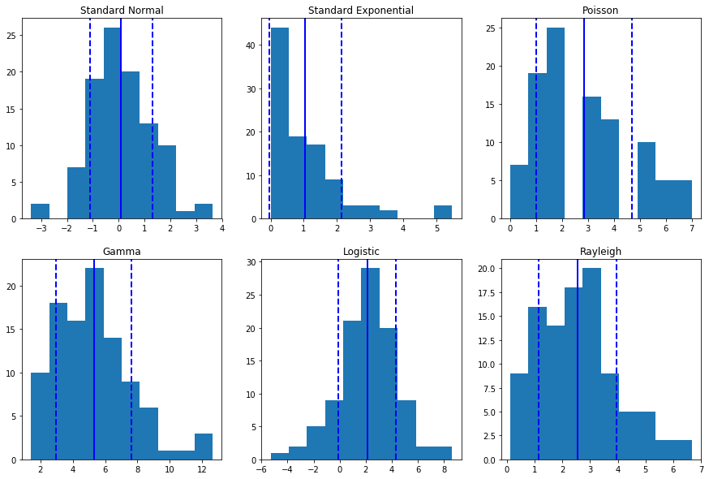
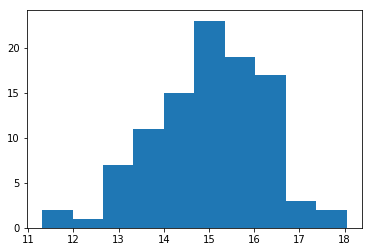
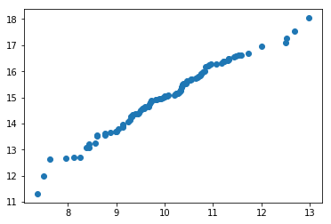

```python
import numpy as np
import pandas as pd
import matplotlib.pyplot as plt

%matplotlib inline
```

1. Generate a random variable with 100 datapoints using the code distributionvar = np.random.distributionname([arguments], 100), replacing distributionvar with an appropriate variable name and distributionname with the name of the distribution you’ve chosen, and filling in the empty space in the parentheses with your chosen values for the appropriate parameters. If you feel uncertain about how to do this, go back to the “Other Distributions” assignment for examples of code to use as a starting point.


```python
#standard normal distribution
standardnormal = np.random.standard_normal(100)

#standard exponential distribution
standardexponential = np.random.standard_exponential(100)

#poisson distribution
poisson = np.random.poisson(3, 100)

#gamma distribution
gamma = np.random.gamma(5,1, 100)

#logistic distribution
logistic = np.random.logistic(2, 1, 100)

#rayleigh distribution
rayleigh = np.random.rayleigh( 2, 100)
```

2. Graph the variable using a histogram.


```python
plt.figure(figsize=(15, 10))

plt.subplot(2, 3, 1)
plt.hist(standardnormal)
plt.title('Standard Normal')

plt.subplot(2, 3, 2)
plt.hist(standardexponential)
plt.title('Standard Exponential')

plt.subplot(2, 3, 3)
plt.hist(poisson)
plt.title('Poisson')

plt.subplot(2, 3, 4)
plt.hist(gamma)
plt.title('Gamma')

plt.subplot(2, 3, 5)
plt.hist(logistic)
plt.title('Logistic')

plt.subplot(2, 3, 6)
plt.hist(rayleigh)
plt.title('Rayleigh')


plt.show()
```


3. Compute the mean and standard deviation and plot them as vertical lines on the histogram. (Hint: the “When Does It Break?” assignment you just completed can help you here.)


```python
plt.figure(figsize=(15, 10))

plt.subplot(2, 3, 1)
plt.hist(standardnormal)
plt.axvline(standardnormal.mean(), color='b', linestyle='solid', linewidth=2)
plt.axvline(standardnormal.mean()+standardnormal.std(), color='b', linestyle='dashed', linewidth=2)
plt.axvline(standardnormal.mean()-standardnormal.std(), color='b', linestyle='dashed', linewidth=2)
plt.title('Standard Normal')

plt.subplot(2, 3, 2)
plt.hist(standardexponential)
plt.axvline(standardexponential.mean(), color='b', linestyle='solid', linewidth=2)
plt.axvline(standardexponential.mean()+standardexponential.std(), color='b', linestyle='dashed', linewidth=2)
plt.axvline(standardexponential.mean()-standardexponential.std(), color='b', linestyle='dashed', linewidth=2)
plt.title('Standard Exponential')

plt.subplot(2, 3, 3)
plt.hist(poisson)
plt.axvline(poisson.mean(), color='b', linestyle='solid', linewidth=2)
plt.axvline(poisson.mean()+poisson.std(), color='b', linestyle='dashed', linewidth=2)
plt.axvline(poisson.mean()-poisson.std(), color='b', linestyle='dashed', linewidth=2)
plt.title('Poisson')

plt.subplot(2, 3, 4)
plt.hist(gamma)
plt.axvline(gamma.mean(), color='b', linestyle='solid', linewidth=2)
plt.axvline(gamma.mean()+gamma.std(), color='b', linestyle='dashed', linewidth=2)
plt.axvline(gamma.mean()-gamma.std(), color='b', linestyle='dashed', linewidth=2)
plt.title('Gamma')

plt.subplot(2, 3, 5)
plt.hist(logistic)
plt.axvline(logistic.mean(), color='b', linestyle='solid', linewidth=2)
plt.axvline(logistic.mean()+logistic.std(), color='b', linestyle='dashed', linewidth=2)
plt.axvline(logistic.mean()-logistic.std(), color='b', linestyle='dashed', linewidth=2)
plt.title('Logistic')

plt.subplot(2, 3, 6)
plt.hist(rayleigh)
plt.axvline(rayleigh.mean(), color='b', linestyle='solid', linewidth=2)
plt.axvline(rayleigh.mean()+rayleigh.std(), color='b', linestyle='dashed', linewidth=2)
plt.axvline(rayleigh.mean()-rayleigh.std(), color='b', linestyle='dashed', linewidth=2)
plt.title('Rayleigh')


plt.show()
```





4. Evaluate whether the descriptive statistics provided useful information about the variable. Can you identify any common characteristics of the distributions that could be usefully described using the mean and/or standard deviation, versus the ones that could not?

The mean and standard deciation provided useful information about the standard normal and logistic distributions. The mean still served as a measure of central tendency for the gamma and rayleigh distributions but the standard deviations for these distributions were not very useful. Neither descriptive statistic provided useful information about the exponential and poisson distributions. Distributions where fewer descriptive statistics could be applied effectively tended to be skewed in a single direction with datapoints not being clustered in a central location.

**Additionally:** 

1. Generate two normally-distributed variables, one with a mean of 5 and standard deviation of 0.5, and the other with a mean of 10 and standard deviation of 1.


```python
normal_mean_5 = np.random.normal(5,.5,100)

normal_mean_10 = np.random.normal(10,1,100)
```

2. Add them together to create a third variable.


```python
new_normal = normal_mean_5 + normal_mean_10
```

3. Graph the third variable using a histogram.


```python
plt.hist(new_normal)
plt.show
```


    <function matplotlib.pyplot.show(*args, **kw)>





4. Compute the mean and standard deviation and plot them as vertical lines on the histogram.


```python
plt.hist(new_normal)
plt.axvline(new_normal.mean(), color='b', linestyle='solid', linewidth=2)
plt.axvline(new_normal.mean()+new_normal.std(), color='b', linestyle='dashed', linewidth=2)
plt.axvline(new_normal.mean()-new_normal.std(), color='b', linestyle='dashed', linewidth=2)
plt.show
```


    <function matplotlib.pyplot.show(*args, **kw)>


5. Evaluate the descriptive statistics against the data.

The mean and standard deviation serves as useful descriptive statistics for this distribution since datapoints are still clustered centrally; even if not truly normally distributed.


```python
normal_mean_10.sort()
new_normal.sort()
plt.plot(normal_mean_10, new_normal, 'o')
```


    [<matplotlib.lines.Line2D at 0x11253e9b0>]





```python

```
