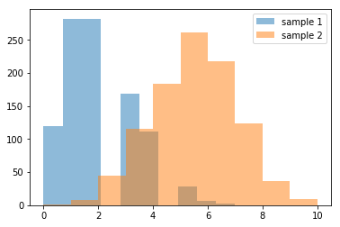

```python
import numpy as np
import pandas as pd
import scipy
import matplotlib.pyplot as plt
%matplotlib inline
```


```python
pop1 = np.random.binomial(10, 0.2, 10000)
pop2 = np.random.binomial(10,0.5, 10000) 

# Let’s make histograms for the two groups. 

plt.hist(pop1, alpha=0.5, label='Population 1') 
plt.hist(pop2, alpha=0.5, label='Population 2') 
plt.legend(loc='upper right') 
plt.show()
```


```python
sample1 = np.random.choice(pop1, 100, replace=True)
sample2 = np.random.choice(pop2, 100, replace=True)

plt.hist(sample1, alpha=0.5, label='sample 1') 
plt.hist(sample2, alpha=0.5, label='sample 2') 
plt.legend(loc='upper right') 
plt.show()
```


```python
print(sample1.mean())
print(sample2.mean())
print(sample1.std())
print(sample2.std())

# Compute the difference between the two sample means.
diff=sample2.mean( ) -sample1.mean()
print(diff)
```

    1.95
    5.06
    1.1947803145348521
    1.482025640803829
    3.1099999999999994


```python
from scipy.stats import ttest_ind
print(ttest_ind(sample2, sample1, equal_var=False))
```

    Ttest_indResult(statistic=16.25510891718832, pvalue=8.959591001347151e-38)


1. Increase the size of your samples from 100 to 1000, then calculate the means and standard deviations for your new samples and create histograms for each. 

**Prediction: If I increase the size of my samples from 100 to 1000, I'd expect the sample means to be closer to the population means and the sample standard deviations to be closer to the population standard deviations.**


```python
# Increasing the sample sizes to 1000 and plotting on histogram

sample1 = np.random.choice(pop1, 1000, replace=True)
sample2 = np.random.choice(pop2, 1000, replace=True)

plt.hist(sample1, alpha=0.5, label='sample 1') 
plt.hist(sample2, alpha=0.5, label='sample 2') 
plt.legend(loc='upper right') 
plt.show()
```





```python
# Computing the new sample means and standard deviations

print(sample1.mean())
print(sample2.mean())
print(sample1.std())
print(sample2.std())
```

    1.992
    5.03
    1.3333926653465586
    1.549548321285916


**The values of the means and standard deviations changed minimally for both samples. However the histogram is more visually representative of the population distributions, implying that the descriptive statistics of the original samples (possibly by chance) were already representative of the population parameters.**

Repeat this again, decreasing the size of your samples to 20. What values change, and what remain the same?

**Prediction: If I were to decrease the sample sizes to 20, I'd expect the mean and standard deviations to change drastically. I'd expect the means to vary more from the population parameters. I'd expect the standard deviations to increase.**


```python
# Decreasing the sample sizes to 20 and plotting on histogram

sample1 = np.random.choice(pop1, 20, replace=True)
sample2 = np.random.choice(pop2, 20, replace=True)

plt.hist(sample1, alpha=0.5, label='sample 1') 
plt.hist(sample2, alpha=0.5, label='sample 2') 
plt.legend(loc='upper right') 
plt.show()
```


```python
print(sample1.mean())
print(sample2.mean())
print(sample1.std())
print(sample2.std())
```

    1.35
    4.6
    1.0136567466356645
    1.2409673645990855


**The means and standard deviations of both samples decreased noticeably.**

2. Change the probability value (p in the NumPy documentation) for pop1 to 0.3, then take new samples and compute the t-statistic and p-value. Then change the probability value p for group 1 to 0.4, and do it again. What changes, and why?

**Prediction: Increasing the probability value is expected to increase the T value.**


```python
#Increasing the probability value of pop1 to .3
pop1 = np.random.binomial(10, 0.3, 10000)

# Taking samples from new pop1
sample1 = np.random.choice(pop1, 100, replace=True)
sample2 = np.random.choice(pop2, 100, replace=True)
```


```python
# Compute the difference between the two sample means.
diff=sample2.mean( ) -sample1.mean()

# Print the T value 
print(ttest_ind(sample2, sample1, equal_var=False))
```

    Ttest_indResult(statistic=8.277226182215934, pvalue=1.8469634893669093e-14)


```python
#Increasing the probability value of pop1 to .3
pop1 = np.random.binomial(10, 0.4, 10000)

# Taking samples from new pop1
sample1 = np.random.choice(pop1, 100, replace=True)
sample2 = np.random.choice(pop2, 100, replace=True)
```


```python
# Compute the difference between the two sample means.
diff=sample2.mean( ) -sample1.mean()

# Print the T value 
print(ttest_ind(sample2, sample1, equal_var=False))
```

    Ttest_indResult(statistic=4.750902140576609, pvalue=3.953722313229915e-06)


**The T value decreased significantly, implying that the difference between the population means decrease as the probability value increases.**

3. Change the distribution of your populations from binomial to a distribution of your choice. Do the sample mean values still accurately represent the population values

**Prediction: After changing the binomial distributions to normal distributions, I would expect the sample means to be representative of the population value.**


```python

#Creating two normally distributed populations
pop1 = np.random.normal(10, 0.2, 10000)
pop2 = np.random.normal(10,0.5, 10000) 

#Calculating mean and standard deviation
print(pop1.mean())
print(pop2.mean())


```

    10.000536853670592
    10.003741749308055


```python
#Creating two samples from the normally distributed populations
sample1 = np.random.choice(pop1, 100, replace=True)
sample2 = np.random.choice(pop2, 100, replace=True)

#Calculating mean and standard deviation
print(sample1.mean())
print(sample2.mean())

```

    9.978673317627647
    9.948605893965842


**After changing the binomial distributions to normal distributions, the sample means were found to be representative of the population value.**


```python

```
